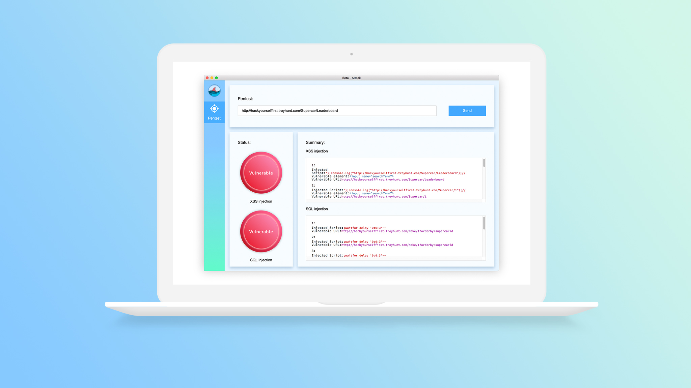

# beta-attack

## What is this?
An open-source desktop application that allows developers to check XSS and SQL injection vulnerabilities with one click.


Get the precise location of vulnerable fields.



## How does this work?
We traverse the DOM and extract input fields and urls with query strings, and we reserve them as attack targets. Then for every input field, we create multiple new PhantomJS isntances to inject standard XSS and SQL scripts, and see if they are sucessfully executed. Currently it only works for small and mid sized applications. If the application contains more than 50 urls, it will cause CPU overload, but we are working hard to figure out alternative ways to perform such test.

## How to install?
For now, please clone the file and do either
```
npm install
```
```
npm run build
```
```
npm run app
```
or
```
yarn install
```
```
yarn build
```
```
yarn app
```
For now, it can take live web applications. However, it's intended to work on local server.

## Contributing
Will accept pull request if it's reasonable.

## License
MIT
